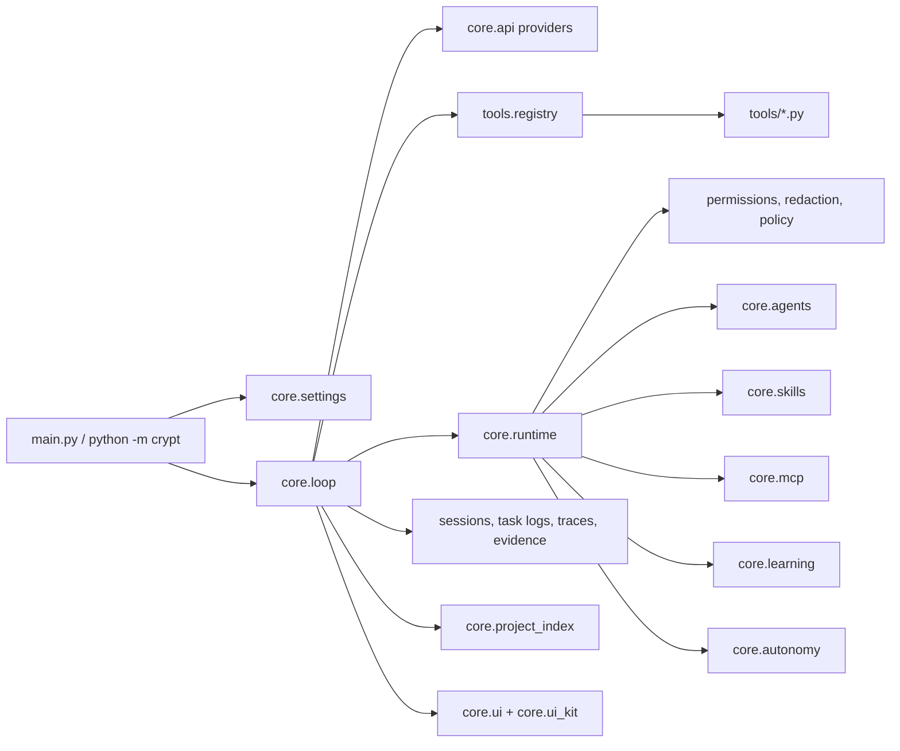

# Architecture

Crypt is intentionally flat: the CLI starts the runtime, `core/` owns durable
behavior, and `tools/` exposes narrow model-visible actions.

## Module Boundaries

| Area | Owns | Should not own |
|---|---|---|
| `main.py` | argument parsing, setup, provider selection | tool behavior or model policy |
| `core/loop.py` | think-act-observe loop and turn orchestration | per-tool business logic |
| `core/api.py` | provider adapters and streaming contracts | local filesystem mutation |
| `core/runtime.py` | session-scoped context shared with tools | persisted user config |
| `core/permissions.py` | allow/deny and danger classification | tool schema validation |
| `core/redact.py` | best-effort secret scrubbing | provider-specific auth lookup |
| `core/tool_policy.py` | cross-tool write-loop and worker-scope checks | file edit mechanics |
| `core/skills.py` | local `SKILL.md` discovery and prompt injection | installer side effects |
| `core/skill_manager.py` | local skill install/list/remove and upstream CLI bridge | prompt injection |
| `core/mcp.py` | one-shot stdio MCP client helpers | long-lived connector process lifecycle |
| `core/task_state.py` | durable task status/event logs | model/tool execution |
| `core/project_index.py` | cached workspace profile and likely commands | deep semantic indexing |
| `core/learning.py` | task episodes, reusable lessons, prompt retrieval | raw transcript replay or secret storage |
| `core/reflection.py` | post-task reflection and lesson extraction | model/tool execution |
| `core/goals.py` | durable objectives and review cadence | external side effects |
| `core/autonomy.py` | safe self-review cycles | spending money, messaging, or unsandboxed actions |
| `core/skill_forge.py` | promote repeated lessons into local skills | remote marketplace publishing |
| `core/webui.py` | local browser cockpit over CryptCore | a separate agent runtime |
| `core/agents/` | typed subagent registry, task state, worktree diffs | parent-loop provider setup |
| `core/ui.py` | public terminal UI facade | raw styling primitives |
| `core/ui_kit/` | reusable terminal components | model/runtime decisions |
| `tools/` | one model-visible tool per file | global orchestration policy |

## Turn Lifecycle

1. The CLI resolves provider, model, approval mode, and workspace. Current shell
   directory wins unless `--cwd` or `CRYPT_ROOT` is explicit.
2. `core.loop` builds the system prompt and sends the current message array.
3. Provider adapters stream text, reasoning, and tool-use blocks.
4. The tool registry validates schemas, permissions, subagent scope, and policy.
5. Tool results are redacted, traced, recorded as evidence, and appended.
6. The loop continues until the assistant returns a final answer.

Each user prompt also creates a task record in `core.task_state`. The loop moves
that task through statuses such as `planning`, `tool_calling`,
`waiting_approval`, `editing`, `verifying`, `completed`, `failed`, and
`cancelled`. This gives terminal, daemon, and future gateway clients one
durable event stream to inspect.

## Tool Lifecycle

Tool modules expose a schema, a summary, optional preflight/classification, and
an execution function. Shared invariants live outside individual tools:

- `tools.registry` handles schema validation and dispatch.
- `core.permissions` handles user approval and danger checks.
- `core.tool_policy` handles repeated writes and subagent write scopes.
- `core.file_state` handles read-before-edit and stale reads.
- `core.redact` scrubs sensitive output before it reaches durable storage.

## Skills And MCP

Crypt uses local skill bundles without making skills a package manager
dependency. A skill is a `SKILL.md` file under a project or user skill root and
is activated by `$skill-name` in the latest user prompt. `core.skill_manager`
adds first-class install/list/remove commands for local folders and can delegate
remote sources to the upstream `npx skills` CLI. Env-var-like all-caps mentions
are ignored, and bundles with obvious prompt-injection or secret-exfiltration
language are blocked. Active skill instructions are injected for that turn only.

MCP is exposed through a conservative generic tool. Server launchers live in
`~/.crypt/config.json` under `mcp_servers`. Each MCP list/call starts the
configured stdio server, performs the JSON-RPC exchange, closes stdin, and
returns the result through the ordinary approval/redaction/evidence path. MCP
servers inherit only a minimal OS/PATH environment unless their config provides
explicit `env` values.

## Subagents

Subagents are typed runtime lanes, not independent products:

| Type | Access | Purpose |
|---|---|---|
| `explorer` | read-only | codebase investigation |
| `planner` | read-only | implementation planning |
| `worker` | scoped write | bounded implementation |
| `verifier` | read-only | adversarial verification |
| `ui_reviewer` | read-only | terminal UI review |
| `release_reviewer` | read-only | release readiness review |

Workers must receive explicit `write_paths`. Isolated worktrees are rejected
when the main tree is dirty so agents cannot accidentally miss uncommitted work.

## Project Intelligence

`core.project_index` maintains a lightweight profile under the project entry in
`~/.crypt/projects/`. It records languages, package managers, frameworks,
entry points, CI files, likely test/build commands, instruction files, visible
skills, key files, git dirtiness, and attention flags. The profile is included
in the system prompt and can be refreshed with `crypt project --refresh` or
exported with `crypt project --json`.

## Learning Loop

`core.learning` records structured task episodes after each completed or failed
turn. Completed turns derive reusable project lessons from runtime evidence:
successful verification commands, recently changed code areas, and recovery
hints from failed tools. The prompt retrieves relevant lessons and prior
episodes for the next user request, so Crypt improves its local operating
knowledge without replaying entire transcripts. Users can inspect and curate
that store with `/learn`, `crypt learn`, or the `learn` tool.

`core.autonomy` runs a safe self-review cycle. It reflects on recent task
episodes, reviews due goals, updates lessons, and can forge project-local
`SKILL.md` bundles from repeated patterns. This is intentionally bounded to
Crypt's own memory/skill state; external actions still go through tools,
permissions, and user approval.

`core.webui` exposes a small local browser cockpit centered on chat. Runtime
state, goals, learning, reflections, autonomy cycles, approvals, and skill
forging remain available through the API and activity drawer, but the main
interaction keeps Crypt presented as one assistant with no visible prompt
recipes or route controls. When launched through `python main.py webui`, it
also starts a safe background autonomy heartbeat. It talks to the same
`AppDaemon` runtime path as other clients.

## Safety Model

Crypt treats model output as untrusted until checked. The production safety path
is layered:

- schemas reject malformed tool calls
- permission rules classify risky shell commands
- write tools require fresh reads for existing files
- generated artifacts and active file formats require explicit handling
- web fetches reject private and rebinding targets
- transcripts, traces, background logs, and shell spill files are redacted

## Release Gates

CI runs across Windows, Ubuntu, and macOS with Python 3.13:

- dependency install and `pip check`
- `pip-audit` against runtime requirements
- `ruff check .`
- compile/import/CLI smoke checks
- deterministic benchmark and target-eval smoke tests
- coverage-gated test suite
- wheel build plus installed-wheel CLI and benchmark smoke checks
